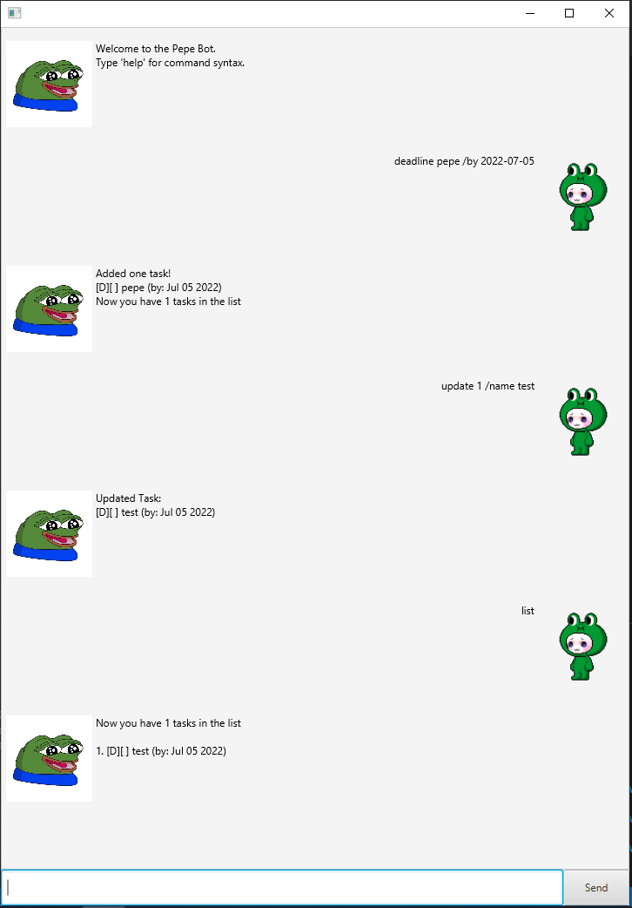

# User Guide
Pepe is a desktop bot for managing (**CRUD**) tasks where you add various types of tasks (`ToDo`, `Deadline`, `Event`) and mark/unmark their completion.

## Quick Start
1. Ensure you have Java 11 or above installed in your Computer.

2. Download the latest `pepe_v1.0.jar` from [here](https://github.com/astraxq/ip/releases/tag/A-Release).

3. Copy the file to the folder you want to use as the home folder for Pepe.

4. Open a command terminal, cd into the folder you put the jar file in, and use the java -jar pepe_v1.0.jar command to run the application.
The application window should appear in a few seconds. 



## Features 

### Feature-Manage Tasks

1. Add/Delete/Update various types of tasks (ToDo, Deadline, Event).
2. Mark/Unmark tasks upon completion.
3. View the entire task list.
4. Filter tasks based on a specific keyword.
5. Help table for user to refer to command syntax.

### Feature-Save Locally
1. Save previous entries from previous access of the application.
2. Load entries from stored ```storage.txt``` file.

## Usage

### `list` - Displays the list of all tasks.

Format: `list`

Example of usage: 

`list`

Expected outcome: the list of task

```
Now you have 3 tasks in the list.

1. [T][X] 1
2. [D][] 2 (by: Mar 12 2022)
3. [E][] 3 (from: Monday to: Friday)

```

### `todo` - Creates a ToDo Task.

Format: `todo [NAME]`

Example of usage: 

`todo task1`

Expected outcome: the task details

```
Added one task! 
[T][] task1
Now you have 4 tasks in the list.
```

### `deadline` - Creates a Deadline Task.

Format: `deadline [NAME] /by [YYYY-MM-DD]`

Example of usage: 

`deadline assignment1 /by 2023-05-01`

Expected outcome:

```
Added one task! 
[D][] assignment1 (by: May 01 2022)
Now you have 4 tasks in the list.
```

### `event` - Creates an Event Task.

Format: `event [NAME] /from [FROM] /to [TO]`

Example of usage: 

`event SOC_CareerFair /from Monday /to Friday`

Expected outcome:

```
Added one task! 
[E][] SOC_CareerFair (from: Monday to: Friday)
Now you have 4 tasks in the list.
```

### `mark` - Marks a given task.

Format: `mark [INDEX]`

Example of usage: 

`mark 1`

Expected outcome:

```
Nice! One Task Down!
[T][X] task1
```

### `unmark` - Unmarks a given task.

Format: `unmark [INDEX]`

Example of usage: 

`unmark 1`

Expected outcome:

```
One more task to go ):
[T][] task1
```

### `update` - Updates a given task.

Format: `update [INDEX] [TYPE (1. /name, 2. /by, 3. /from, 4. /to)] [NEW_VALUE]`

Example of usage: 

`update 1 /name newTask`

Expected outcome:

```
Updated Task:
[T][] newTask
```

### `help` - Displays the command syntax.

Format: `help`

Example of usage: 

`help`

Expected outcome:

```
list 
-displays the list of tasks.

todo [NAME]
-creates a todo task.

deadline [NAME] /by [YYYY-MM-DD]
-creates a deadline task.

event [name] /from [FROM] /to [TO]
-creates a event task.

mark [INDEX]
-marks the task based on its index.

unmark [INDEX]
-unmarks the task based on its index.

update [INDEX] [TYPE (1. /name, 2. /by, 3. /from, 4. /to)] [NEW_VALUE]
-updates the value of the task based on the index\n and type (E.g /name /by /from /to).

find [KEYWORD]
-finds all tasks' name that contains the keyword.

help
-returns command syntax that Pepe can offer.

bye
-terminates program
```
### `bye` - Terminates the application.

Format: `bye`

Example of usage: 

`bye`


